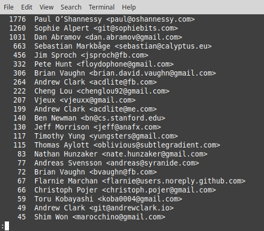
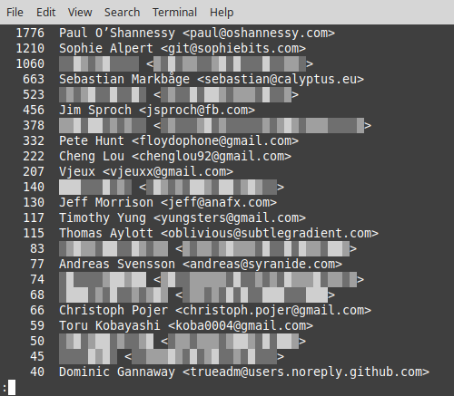

git-thanos
==========
Like most OSS projects yours was allowed to grow unchecked. Too many contributors, not enough time to review their patches. Now your project is on the brink of collapse. How do you bring balance back to it?

git-thanos offers a simple solution. With just a single command half your contributors would cease to exist. At random. Dispassionate, fair. Gurus and noobs alike.

Prerequisites
-------------
The hardest choices require the strongest wills.

Installing
----------
`npm install -g git-thanos`

Usage
-----
To rebalance your project, cd to the git working directory and run `git-thanos`. The process might take a long time. Afterward, you finally rest. And watch git outputs the shortlog of a grateful repository:

 

Depending on your hardware, it might be necessary to enable certain experimental features. To see a complete list, please run `git-thanos -h`.

License
-------
This project is licensed under the WTFPL License - see [LICENSE](LICENSE) for details.

Acknowledgments
---------------
Special hat tip to Eitri and the rest of the crew at Nidavellir.
